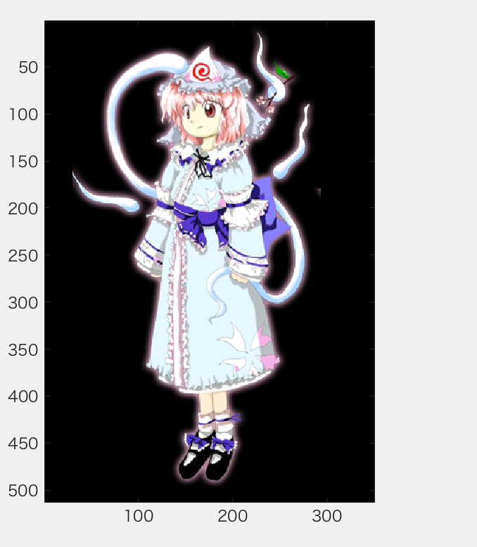
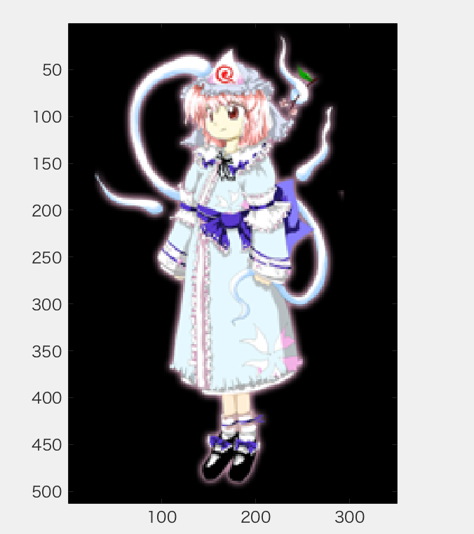
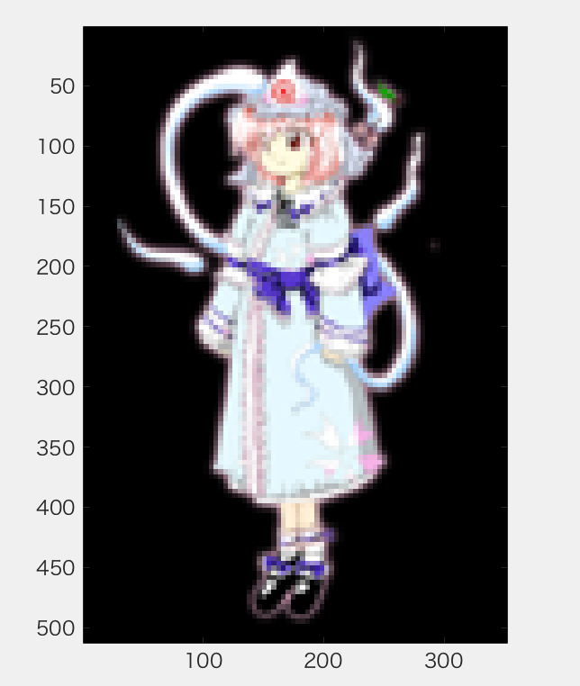
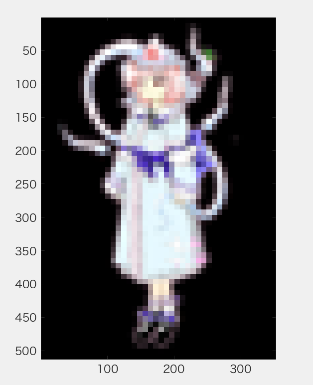
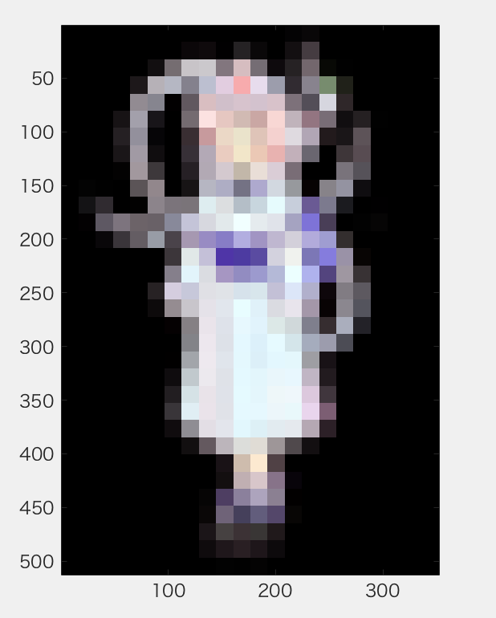
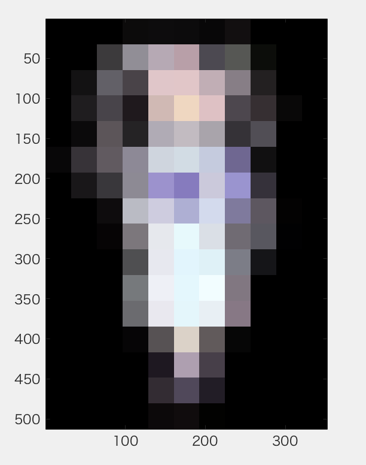

画像をダウンサンプリングして（標本化間隔を大きくして）表示せよ．  
課題１では、画像の拡大縮小をmatlabで扱います。  
もとの画像は次のものを使用します。  
  
図１　元画像

```Matlab
clear; % 変数のオールクリア

ORG=imread('./1-0.png'); % 原画像の入力
imagesc(ORG); axis image; % 画像の表示
pause; % 一時停止
```
  
図2　matlabの標準の出力

`imresize()`を使用すると、画像を拡大縮小できます。
>B = imresize(A,scale) は、A のサイズの scale 倍のイメージ B を出力します。入力イメージ A は、グレースケール イメージ、RGB イメージ、バイナリ イメージのいずれでも構いません。scale が 0 から 1.0 までの場合、B は A より小さくなります。scale が 1.0 より大きい場合、B は A より大きくなります

```Matlab
IMG = imresize(ORG,0.5); % 画像の縮小
IMG2 = imresize(IMG,2,'box'); % 画像の拡大
imagesc(IMG2); axis image; % 画像の表示
pause; % 一時停止
```

  
図3　1/2サンプリング  


```Matlab
IMG = imresize(IMG,0.5); % 画像の縮小
IMG2 = imresize(IMG,4,'box'); % 画像の拡大
imagesc(IMG2); axis image; % 画像の表示
pause; % 一時停止
```
  
図3　1/4サンプリング

```Matlab
IMG = imresize(IMG,0.5); % 画像の縮小
IMG2 = imresize(IMG,8,'box'); % 画像の拡大
imagesc(IMG2); axis image; % 画像の表示
pause; % 一時停止
```
  
図3　1/8サンプリング

```Matlab
IMG = imresize(IMG,0.5); % 画像の縮小
IMG2 = imresize(IMG,16,'box'); % 画像の拡大
imagesc(IMG2); axis image; % 画像の表示
pause; % 一時停止
```
  
図4　1/16サンプリング
```Matlab
IMG = imresize(IMG,0.5); % 画像の縮小
IMG2 = imresize(IMG,32,'box'); % 画像の拡大
imagesc(IMG2); axis image; % 画像の表示
```
  
図5　1/32サンプリング

このようにサンプリング幅が大きくなると，モザイク状のサンプリング歪みが発生する。
