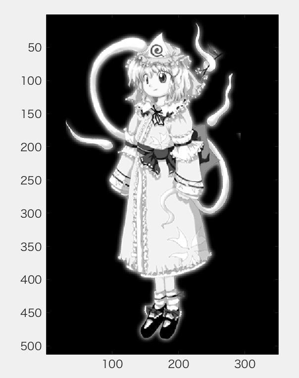
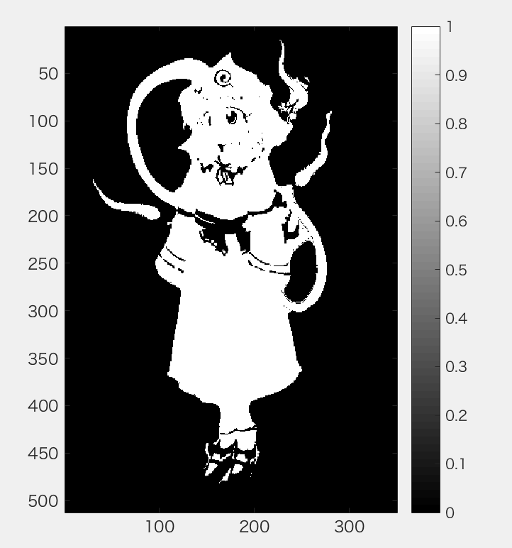
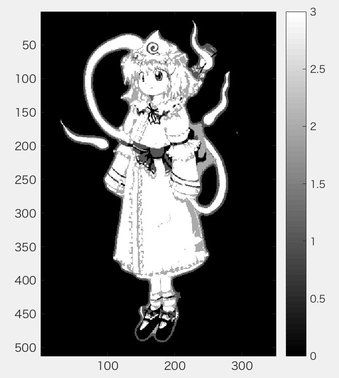

***
課題２　階調数と疑似輪郭  
２階調，４階調，８階調の画像を生成せよ．  
下記はサンプルプログラムである．  
課題作成にあたっては「Lenna」以外の画像を用いよ．  
***
>階調とは、コンピュータが画像を扱う際に、色の濃さや明るさを何段階で表現することができるかを表す数。この数が大きいほど細かな色や明るさの違いを表現できるが、画素あたりのデータ量は増大する。

```Matlab
ORG = rgb2gray(ORG); colormap(gray); colorbar;
imagesc(ORG); axis image; % 画像の表示
pause; % 一時停止
```
  
図1　グレースケール変換後

```Matlab
% ２階調画像の生成
IMG = ORG>128;
imagesc(IMG); colormap(gray); colorbar;  axis image;
pause;
```
  
図2　2階調画像

```Matlab
% ４階調画像の生成
IMG0 = ORG>64;
IMG1 = ORG>128;
IMG2 = ORG>192;
IMG = IMG0 + IMG1 + IMG2;
imagesc(IMG); colormap(gray); colorbar;  axis image;
```
  
図2　4階調画像


### 参考サイト
階調  
http://e-words.jp/w/%E9%9A%8E%E8%AA%BF.html
