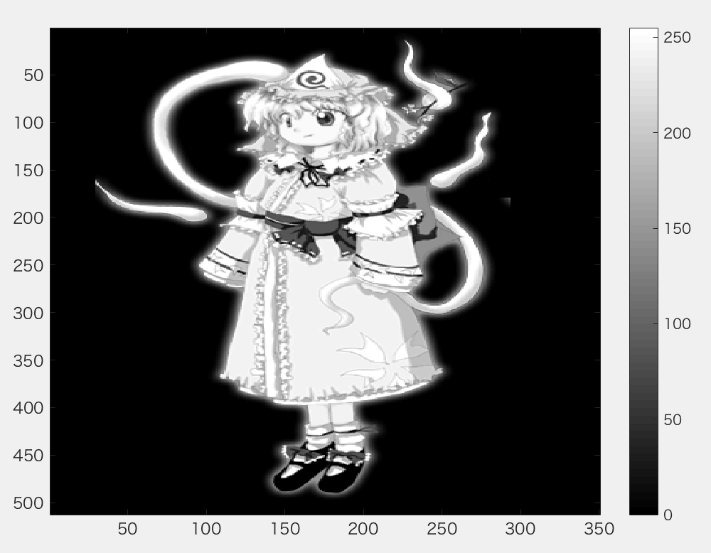
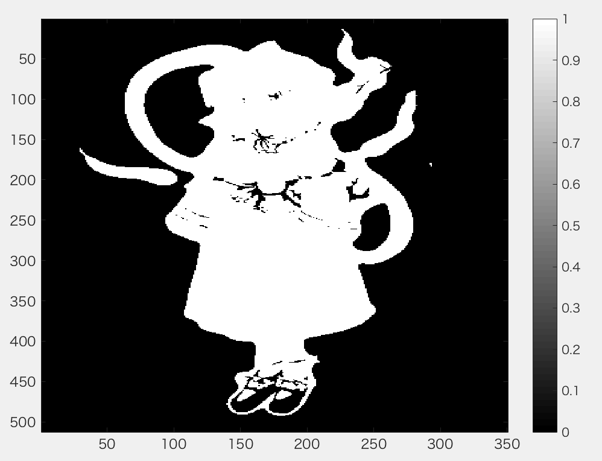
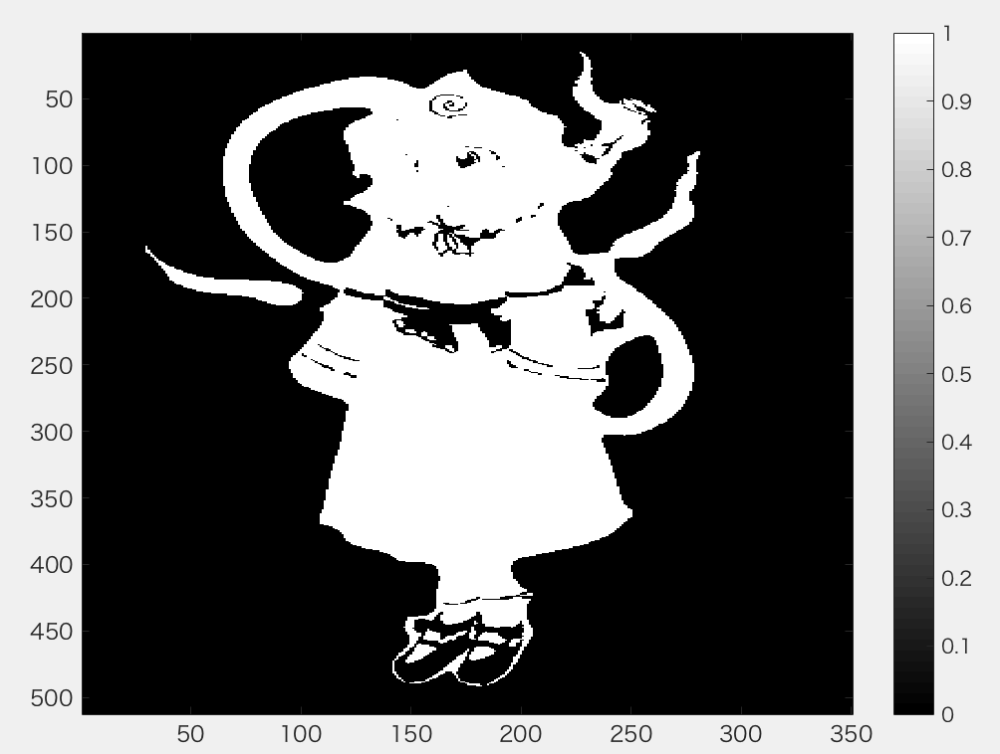
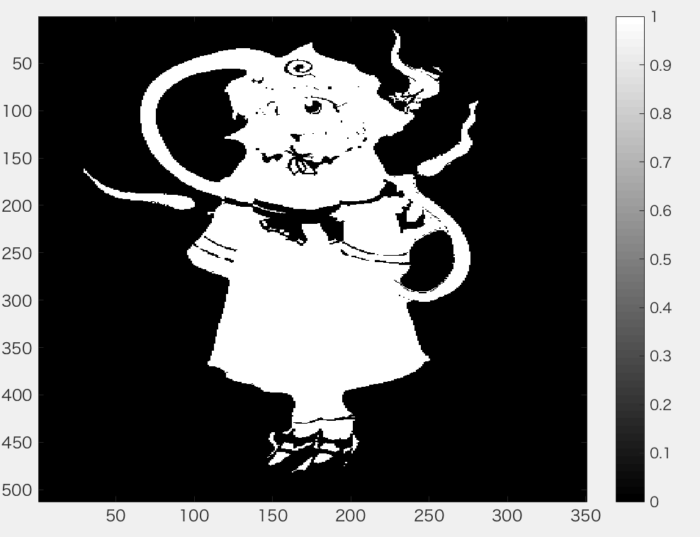
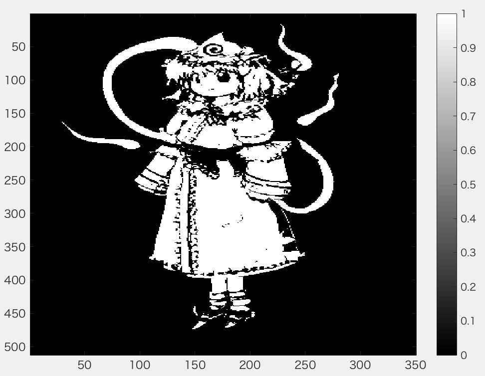

***
課題３　閾値処理  
閾値を4パターン設定し,閾値処理た画像を示せ．  
課題作成にあたっては「Lenna」以外の画像を用いよ．
***

```Matlab
ORG= rgb2gray(ORG); % カラー画像を白黒濃淡画像へ変換

imagesc(ORG); colormap(gray); colorbar; % 画像の表示
pause;
```
  
図1　グレースケール変換後


```Matlab
IMG = ORG > 64; % 輝度値が64以上の画素を1，その他を0に変換
imagesc(IMG); colormap(gray); colorbar;
pause;
```
  
図2　閾値64の二値化

```Matlab
IMG = ORG > 96;
imagesc(IMG); colormap(gray); colorbar;
pause;
```
  
図3　閾値96の二値化


```Matlab
IMG = ORG > 128;
imagesc(IMG); colormap(gray); colorbar;
pause;
```
  
図4　閾値128の二値化

```Matlab
IMG = ORG > 192;
imagesc(IMG); colormap(gray); colorbar;

```
  
図5　閾値192の二値化
