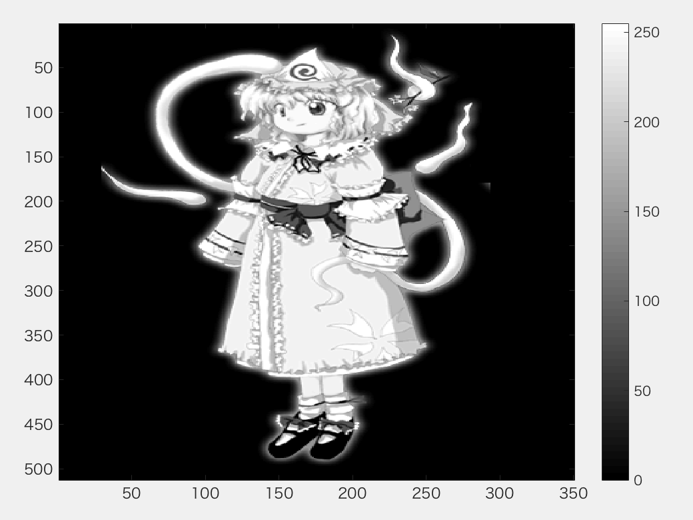
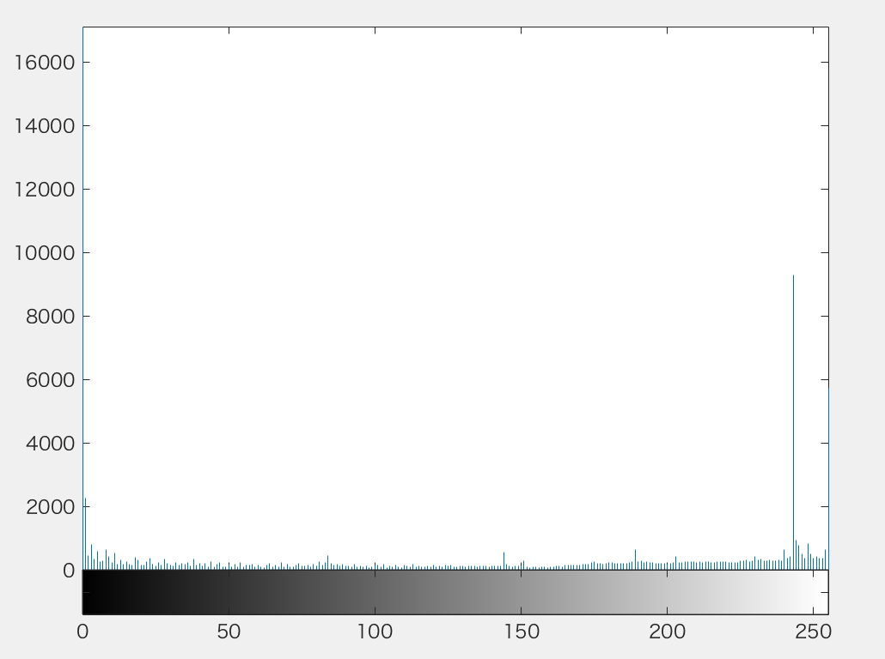

***
課題４　画像のヒストグラム  
画素の濃度ヒストグラムを生成せよ．  
下記はサンプルプログラムである．  
課題作成にあたっては「Lenna」以外の画像を用いよ．  
***
Matlabでは濃度ヒストグラムを作成できる。  
画像に濃度がどのように分布しているのかを、視覚化することができるのだ。

```Matlab
ORG=rgb2gray(ORG); % カラー画像を白黒濃淡画像へ変換
imagesc(ORG); colormap(gray); colorbar;
pause;

imhist(ORG); % ヒストグラムの表示
```

  
図1　グレースケール変換後


  
図2 図1の濃度ヒストグラム
