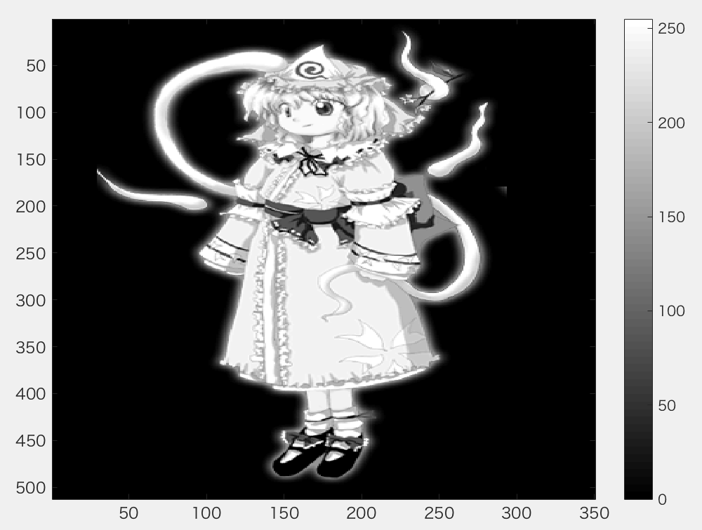
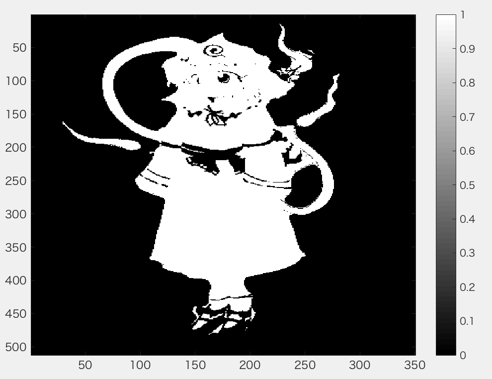
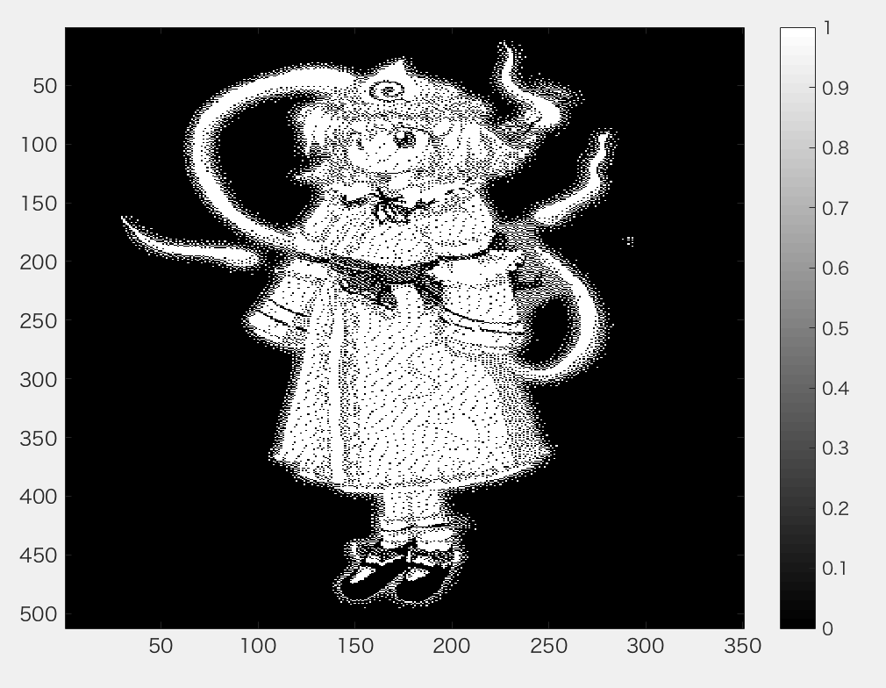

***
課題６　画像の二値化  
下記のプログラムを参考にして画像を二値化せよ．  
下記はサンプルプログラムである．  
課題作成にあたっては「Lenna」以外の画像を用いよ．  
***
```Matlab
clear; % 変数のオールクリア
ORG=imread('Lenna.png'); % 原画像の入力
ORG = rgb2gray(ORG);
imagesc(ORG); colormap(gray); colorbar; % 画像の表示
pause; % 一時停止
```
  
図1　グレースケール変換後


```Matlab
IMG = ORG>128; % 128による二値化
imagesc(IMG); colormap(gray); colorbar; % 画像の表示
pause;
```
  
図2　閾値128による二値化

```
IMG = dither(ORG); % ディザ法による二値化
imagesc(IMG); colormap(gray); colorbar; % 画像の表示
```
  
図2　ディザ法による二値化
