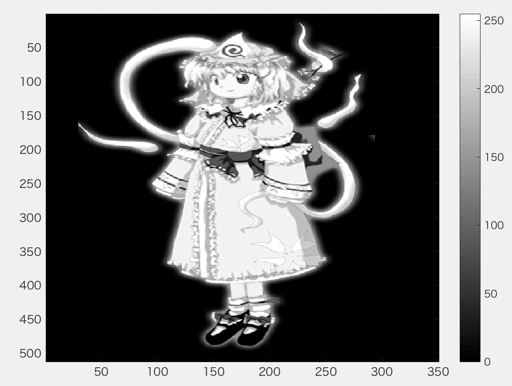
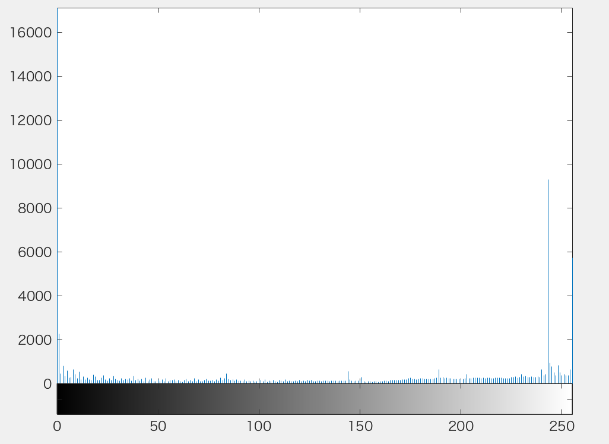
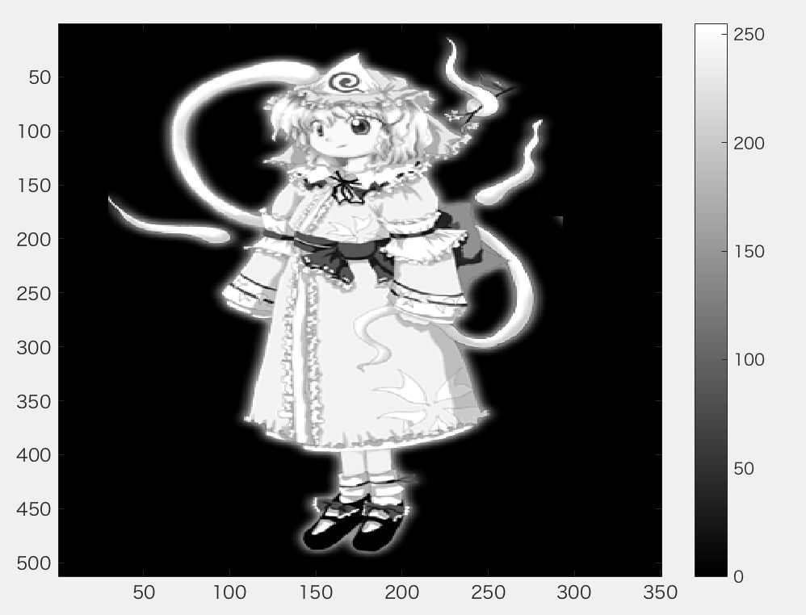
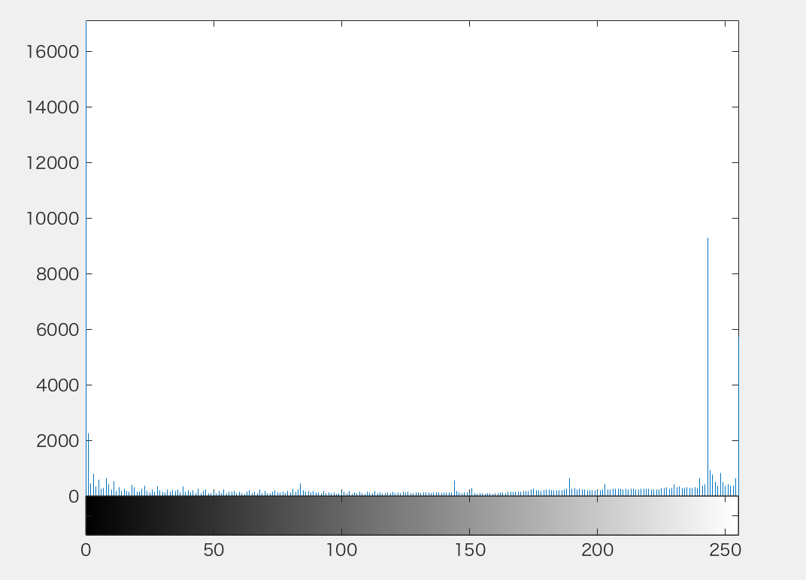

***
課題7　ダイナミックレンジの拡大  
画素のダイナミックレンジを０から２５５にせよ．   
下記はサンプルプログラムである．   
課題作成にあたっては「Lenna」以外の画像を用いよ．   
***


```Matlab
ORG = rgb2gray(ORG); % 白黒濃淡画像に変換
imagesc(ORG); colormap(gray); colorbar; % 画像の表示
pause;
imhist(ORG); % 濃度ヒストグラムを生成、表示
pause;
```
  
図1　グレースケール変換後
  
図2　グレースケール変換後の濃度ヒストグラム


```Matlab
ORG = double(ORG);
mn = min(ORG(:)); % 濃度値の最小値を算出
mx = max(ORG(:)); % 濃度値の最大値を算出
ORG = (ORG-mn)/(mx-mn)*255;
imagesc(ORG); colormap(gray); colorbar; % 画像の表示
pause;
ORG = uint8(ORG); % この行について考察せよ
imhist(ORG); % 濃度ヒストグラムを生成、表示
```
  
図3　double型変換後
  
図4　double型変換後の濃度ヒストグラム

`ORG = uint8(ORG);`について  
この行をコメントあうとして実行したところ、次のエラーが表示された。
>エラー: imhist
1 番目の入力引数 I or Xを2 次元にする必要があります。...

最初の行で画像をdouble型へ変換しているため、`imhist()`を使うには8ビット符号なし整数へ変換する必要があるようだ。そのため、`uint8()`を実行していると考えられる。
