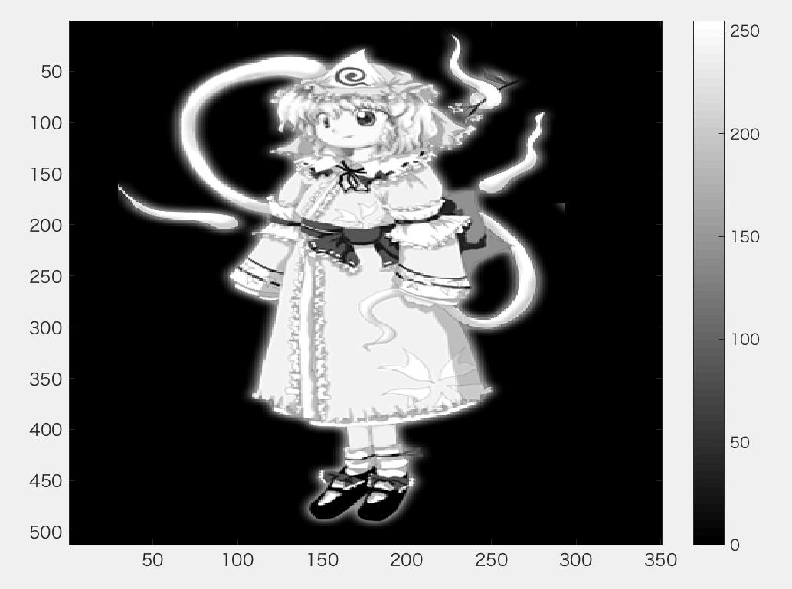
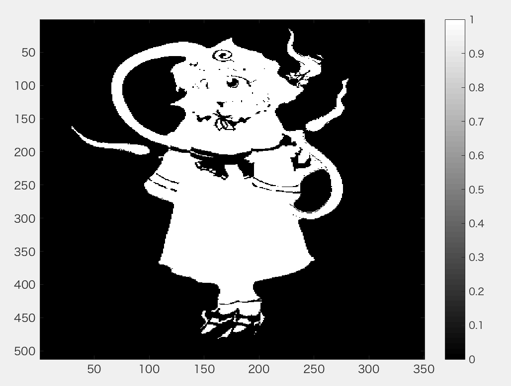
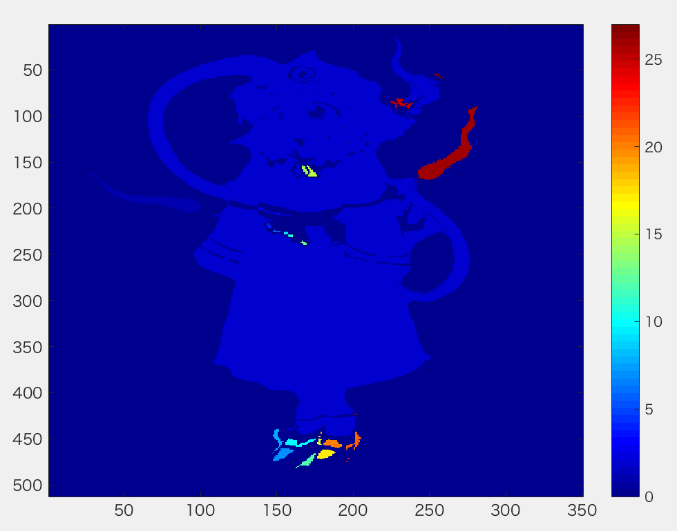

***
課題８ ラベリング  
二値化された画像の連結成分にラベルをつけよ．  
下記はサンプルプログラムである．   
課題作成にあたっては「Lenna」以外の画像を用いよ.
***

```
ORG = rgb2gray(ORG); % 白黒濃淡画像に変換
imagesc(ORG); colormap(gray); colorbar; % 画像の表示
pause;
```
  
図1　グレースケール変換後
```
IMG = ORG > 128; % 閾値128で二値化
imagesc(IMG); colormap(gray); colorbar; % 画像の表示
pause;
```
  
図2　閾値128の二値化画像

```
IMG = bwlabeln(IMG);
imagesc(IMG); colormap(jet); colorbar; % 画像の表示
pause;
```
  
図3　ラベル付け画像
