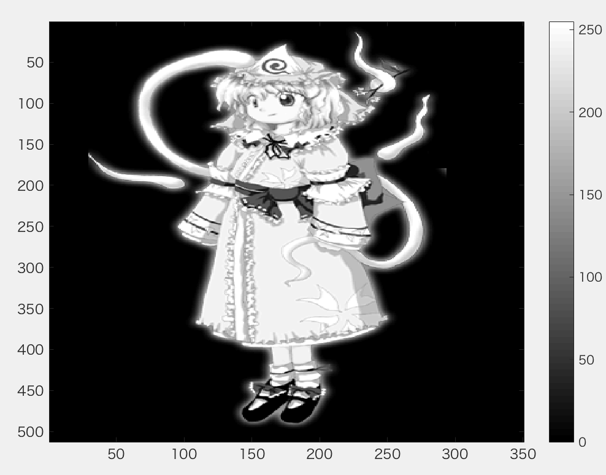
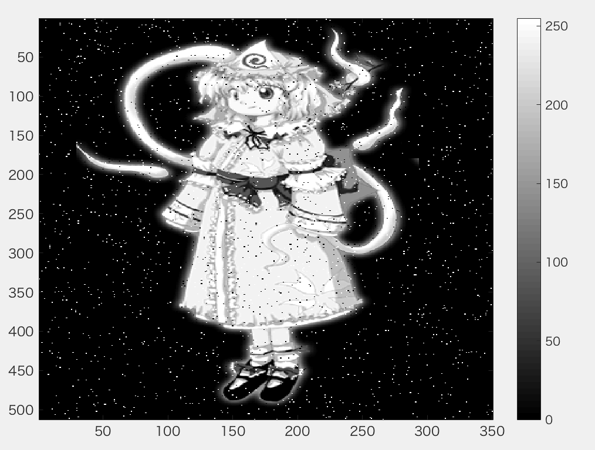
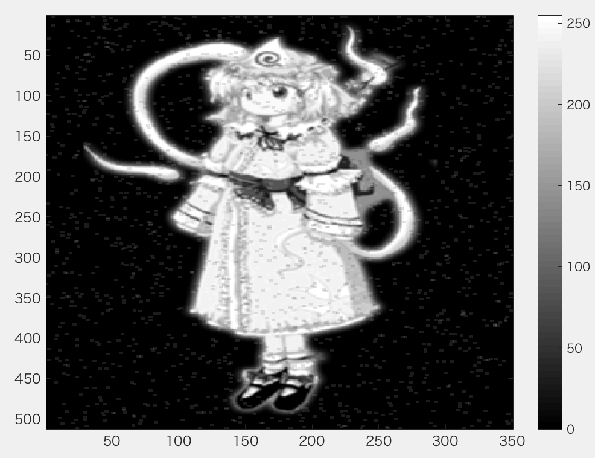
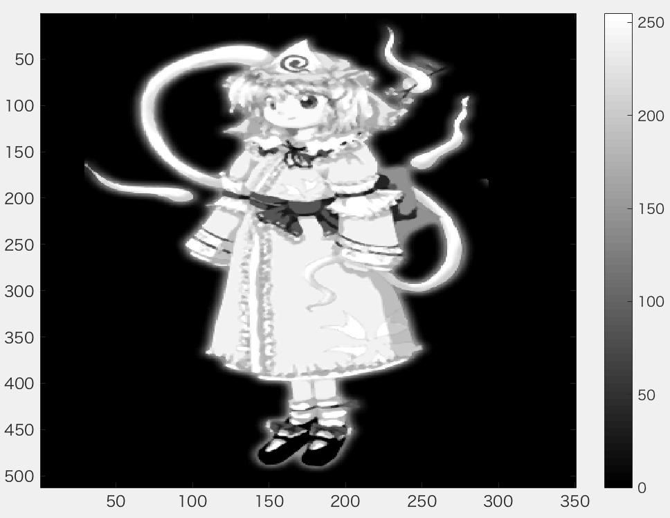

***
課題９ メディアンフィルタと先鋭化  
メディアンフィルターを適用し，ノイズ除去を体験せよ．  
各自，Lenna以外の画像を用いよ．
***

```Matlab
ORG = rgb2gray(ORG); % 白黒濃淡画像に変換
imagesc(ORG); colormap(gray); colorbar; % 画像の表示
pause;
```
  
図1　グレースケール変換後

```Matlab
ORG = imnoise(ORG,'salt & pepper',0.02); % ノイズ添付
imagesc(ORG); colormap(gray); colorbar; % 画像の表示
pause;
```
  
図2　ノイズ添付後

```Matlab
IMG = filter2(fspecial('average',3),ORG); % 平滑化フィルタで雑音除去
imagesc(IMG); colormap(gray); colorbar; % 画像の表示
pause;
```
  
図3　平滑化フィルタでノイズ除去後

```Matlab
IMG = medfilt2(ORG,[3 3]); % メディアンフィルタで雑音除去
imagesc(IMG); colormap(gray); colorbar; % 画像の表示
pause;
```
  
図4　メディアンフィルタでノイズ除去後

```Matlab
f=[0,-1,0;-1,5,-1;0,-1,0]; % フィルタの設計
IMG = filter2(f,IMG,'same'); % フィルタの適用
imagesc(IMG); colormap(gray); colorbar; % 画像の表示
pause;
```
  
図5　フィルタ適用後
